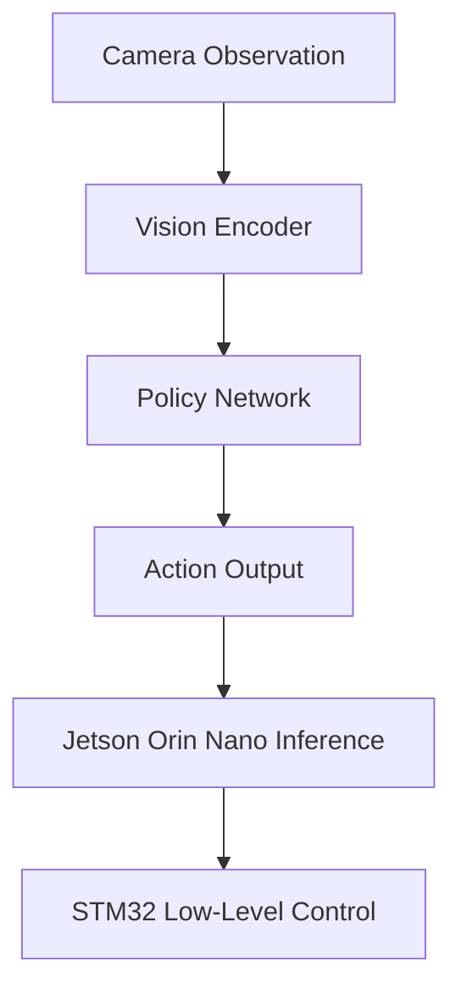

# [착수보고서] **JetBot 온보드 비전 기반 자율 물체 수집 및 목표 구역 이동 시스템**

**부산대학교 정보컴퓨터공학부**

**지도교수: 김종덕**

**팀원:** 202045106 김주환 (데이터 품질 관리 및 자동화 인프라 분석)

팀원: 202055575 이동근 (강화학습 기반 자율 주행 및 인지 모델링)

팀원: 202170116 윤민석 (MCU 기반 하위 제어 및 고신뢰성 통신 시스템)

---

## 1 과제 개요

### 1.1 **과제 배경 및 필요성**

**< VLA (vision-language-action model) 을 언급하는게 좋을까? >** 

본 과제는 JetBot 기반 자율 RC카가 제한된 경기장 안에서 카메라를 이용해 주변 환경을 인식하고, 무작위로 배치된 스펀지 블록을 목표 구역으로 이동시키는 피지컬 AI 시스템을 설계하고 구현하는 것을 목표로 한다. 경기 환경은 1.5~2m 크기의 정사각형 경기장으로 구성되며, 벽은 없고 검은색 테이프 경계선만 존재한다. 경기장 내부에는 5cm × 5cm × 5cm 크기의 경량 스펀지 블록 5개가 배치되고, 로봇은 이를 30cm × 30cm 크기의 붉은색 테이프 목표 구역으로 밀어(push) 넣어야 한다.

기존의 로봇공학 시스템은 사전에 정의된 환경 모델, 비교적 명확한 센서 입력, 정해진 경로 계획과 제어 규칙을 바탕으로 안정적인 동작을 수행하는 데 강점을 가진다. 이러한 접근은 모터 제어, 주행 안정화, 센서 처리와 같은 저수준 제어를 구현하는 데 필수적이다. 그러나 본 과제처럼 물체 위치가 무작위이고, 로봇이 실시간 카메라 입력을 통해 현재 상황을 해석해야 하며, push 동작의 성공 여부가 물리적 접촉과 자세 정렬에 따라 달라지는 환경에서는 고정된 규칙만으로 모든 상황을 안정적으로 처리하기 어렵다.

따라서 본 과제에서는 카메라 관측으로부터 로봇의 행동을 직접 결정하는 Vision-Action Policy 중심의 Physical AI 접근을 적용하고자 한다. Isaac Sim 기반 시뮬레이션 환경을 구축하고, 고성능 GPU를 활용한 병렬 강화학습을 통해 다양한 블록 배치와 물리 조건에서 동작 가능한 정책을 학습시킨 뒤, 학습된 정책을 실제 JetBot 환경에 적용하여 sim-to-real 차이를 분석하고 보정할 계획이다. Jetson Orin Nano는 카메라 영상 기반 policy 추론과 고수준 행동 결정을 담당하고, STM32 MCU는 모터 제어, IMU 기반 주행 안정화, 진동 데이터 로깅, 통신 timeout 및 비상 정지와 같은 저수준 제어를 담당하도록 설계한다. 이를 통해 학습 기반 판단과 전통적 제어 안정성을 결합하고, 실제 주행 중 발생하는 물리적 흔들림까지 기록하여 시스템의 신뢰성을 검증하고자 한다.

### 1.2 과제 목표

본 과제의 목표는 단순히 JetBot이 스펀지 블록을 목표 구역으로 이동시키는 기능을 구현하는 데 그치지 않는다. 본 과제는 카메라 기반 관측으로부터 로봇의 행동을 학습하고, 학습된 정책을 실제 JetBot에 적용하여 물리 환경에서의 접촉 기반 물체 이동 작업을 수행할 수 있는지 검증하는 것을 목표로 한다. 특히 무작위로 배치된 블록, 벽이 없는 경기장, push 과정에서 발생하는 마찰과 자세 변화, 경계선 이탈 위험 등 규칙 기반 제어만으로 처리하기 어려운 요소를 Vision-Action Policy와 저수준 안정화 제어를 결합하여 해결하고자 한다.

이를 통해 본 프로젝트는 다음과 같은 기술적 목표를 가진다.

| 목표 구분 | 내용 |

| --- | --- |

| Physical AI 검증 목표 | 카메라 관측을 바탕으로 현재 상황에 적합한 행동을 선택하고, 이를 실제 로봇 동작으로 연결하는 인지-판단-제어 통합 구조를 검증한다. |

| 학습 기반 행동 정책 목표 | Isaac Sim 환경에서 병렬 강화학습을 수행하여, 사람이 모든 규칙을 직접 설계하지 않고도 블록 접근, 정렬, push, 회피 행동을 학습하는 Vision-Action Policy를 구현한다. |

| 접촉 기반 물체 이동 목표 | 로봇과 블록 사이의 접촉, 마찰, push 각도, 목표 방향 정렬이 필요한 물체 이동 문제를 실제 경기 환경에서 수행한다. |

| 주행 안정성 목표 | IMU와 진동 데이터를 활용하여 급격한 회전, 흔들림, 자세 불안정성을 줄이고, 부드러운 주행 제어의 가능성을 검증한다. |

| Sim-to-Real 목표 | 시뮬레이션에서 학습한 정책을 Jetson Orin Nano 기반 실제 JetBot에 적용하고, 시뮬레이션과 실제 환경의 차이를 분석 및 보정한다. |

| 시스템 신뢰성 목표 | Jetson Orin Nano의 고수준 판단과 STM32 MCU의 저수준 제어를 분리하고, 통신 timeout, 안전 정지, 주행 데이터 로깅을 통해 실제 시스템의 신뢰성을 검증한다. |

| 경기 수행 목표 | 위 구조를 바탕으로 제한 시간 5분 내 가능한 많은 블록을 목표 구역으로 이동시키고, 전체 작업 완료 시간을 줄이는 방향으로 시스템을 개선한다. |

### 1.3 기대효과

본 과제를 통해 카메라 기반 인식, 강화학습 기반 행동 결정, 임베디드 저수준 제어가 결합된 Physical AI 시스템의 구현 가능성을 검증할 수 있다. 특히 Isaac Sim에서 다양한 블록 배치와 물리 조건을 병렬로 학습시키고, 학습된 Vision-Action Policy를 Jetson Orin Nano 기반 실제 JetBot에 적용함으로써 시뮬레이션 학습 결과가 실제 로봇 작업으로 전이되는 과정을 경험하고 분석할 수 있다.

또한 본 과제는 단순히 목표 구역에 블록을 많이 이동시키는 경기 수행을 넘어, 접촉 기반 물체 이동 과정에서 발생하는 마찰, push 각도, 자세 변화, 경계선 위험을 함께 다룬다. 이를 통해 사람이 모든 예외 규칙을 직접 작성하는 방식의 한계를 줄이고, 로봇이 카메라 관측을 바탕으로 상황에 맞는 행동을 학습하는 접근의 가능성과 한계를 확인할 수 있다.

Jetson Orin Nano와 STM32 MCU를 분리한 계층형 구조는 학습 기반 판단과 전통적 제어 안정성을 결합하는 효과를 가진다. Jetson Orin Nano는 policy 추론과 고수준 행동 결정을 담당하고, STM32 MCU는 모터 제어, IMU 기반 주행 안정화, 진동 데이터 로깅, 안전 정지를 담당함으로써 실제 로봇 시스템에서 요구되는 신뢰성과 안전성을 높이는 방향으로 설계할 수 있다.

마지막으로 본 과제는 자율주행, 모바일 로봇, 실험실 자동화와 같이 물리적 이동의 정확도뿐 아니라 부드러운 주행과 운송 안정성이 요구되는 분야로 확장 가능한 경험을 제공한다. 주행 중 발생하는 진동과 자세 변화를 기록하고 분석함으로써, 목표 달성 여부뿐 아니라 시스템이 얼마나 안정적으로 동작했는지를 함께 평가하는 기준을 마련할 수 있을 것으로 기대된다.

---

## 2 요구사항 분석

### 2.1 경기 규칙 및 평가 조건 분석

해당과제가 해결할 문제는 1.5~2m 정사각형 경기장에서 단일 JetBot이 5개의 스펀지 블록을 30cm × 30cm 목표 구역으로 이동시키는 문제이다. 경기장에는 벽이 없고 검은색 테이프 경계선만 존재하므로, 로봇은 카메라 관측과 제어 판단을 통해 이탈 위험을 스스로 줄여야 한다. 평가는 5분 제한 시간 내 목표 구역으로 이동시킨 블록 수를 기준으로 이루어지며, 5개 전체 이동 완료 시 소요 시간에 따른 보너스가 주어지고 블록을 경기장 밖으로 밀어낼 경우 감점이 발생한다.

이 규칙은 시스템 관점에서 단순한 주행 문제가 아니라 무작위 환경에서의 접촉 기반 물체 이동 문제로 해석할 수 있다. 로봇은 블록을 밀어서 이동시키므로 접촉 위치, push 각도, 바닥 마찰, 로봇의 회전 흔들림이 결과에 영향을 주며, 전체 작업 시간도 함께 고려해야 한다. 따라서 본 프로젝트에서는 Isaac Sim 기반 병렬 강화학습으로 다양한 블록 배치와 물리 조건을 경험한 Vision-Action Policy를 학습시키고, 실제 JetBot 적용 단계에서는 성공 블록 수뿐 아니라 IMU 로그 기반 진동·급회전·충격 분석을 통해 주행 안정성과 시스템 신뢰성도 함께 평가한다.

### 2.2 기능적 요구사항

본 시스템은 시뮬레이션 학습, 실제 로봇 적용, 저수준 제어, 주행 품질 평가가 연결된 구조로 설계한다. 핵심 기능 요구사항은 다음과 같다.

| 핵심 요구사항 | 설명 |

| --- | --- |

| 카메라 기반 환경 관측 | JetBot의 온보드 카메라로 블록, 목표 구역, 경계선이 포함된 장면을 관측하고 policy 입력으로 활용한다. |

| Isaac Sim 병렬 강화학습 | 다양한 블록 배치, 마찰 조건, 초기 자세를 포함하는 시뮬레이션 환경에서 Vision-Action Policy를 학습한다. |

| 관측 기반 action 출력 | 객체 탐지 결과에만 의존하지 않고 카메라 관측을 바탕으로 블록 접근, 정렬, push, 회피 등 행동을 결정한다. |

| Jetson Orin Nano 기반 policy 실행 | 학습된 policy를 Jetson Orin Nano에서 실행하여 실제 JetBot의 고수준 행동 결정을 수행한다. |

| STM32 MCU 기반 모터 제어 | Jetson의 명령을 PWM, 모터 드라이버 제어, 안전 정지 동작으로 변환한다. |

| Jetson-STM32 명령 통신 | UART 기반 명령 전달, 응답 확인, timeout, 비상 정지를 통해 예외 상황에서 안전하게 동작하도록 한다. |

| IMU 로그 기반 안정성 분석 | 주행 후 가속도 및 자이로 로그를 분석하여 진동, 충격, 급회전, 자세 흔들림을 평가한다. |

| 제한 시간 내 블록 이동 | 5분 내 가능한 많은 블록을 목표 구역으로 이동시키고, 전체 완료 시간을 줄이는 방향으로 시스템을 개선한다. |

### 2.3 비기능적 요구사항

본 시스템은 경기 중 실시간으로 행동을 선택해야 하므로 policy 추론 속도와 제어 주기의 안정성이 중요하다. Jetson Orin Nano에서 실행되는 policy는 카메라 입력을 처리하고 다음 행동을 결정해야 하며, 이 과정이 지나치게 지연되면 로봇이 이미 다른 위치로 이동한 뒤 늦은 명령을 수행할 수 있다. 따라서 추론 주기, 카메라 프레임 처리 속도, Jetson-STM32 명령 전달 지연을 함께 고려하여 실제 주행 가능한 수준의 제어 루프를 구성해야 한다.

강화학습 기반 policy는 사람이 작성한 규칙보다 다양한 상황에 적응할 가능성이 있지만, 실제 로봇에서는 예측하지 못한 행동을 출력할 수 있다. 이를 보완하기 위해 STM32 MCU는 Jetson 명령을 그대로 실행하는 장치에 머무르지 않고, 통신 timeout, 모터 출력 제한, 비상 정지, 실행 시간 제한과 같은 안전 기능을 독립적으로 수행해야 한다. 이 구조는 학습 기반 판단이 실패하더라도 저수준 제어 계층에서 위험을 줄이기 위한 최소한의 안전 장치로 작동한다.

Isaac Sim에서 학습한 정책을 실제 JetBot에 적용하기 위해서는 sim-to-real 차이를 고려해야 한다. 시뮬레이션의 카메라, 조명, 마찰, 모터 응답, 블록 질량과 실제 환경은 완전히 일치하지 않기 때문에, 학습 단계에서는 물리 조건을 다양화하고 실제 적용 단계에서는 실패 사례를 수집하여 정책과 제어 파라미터를 보정할 필요가 있다. 실험 조건, 모델 버전, reward 구성, 주행 결과를 기록하여 동일한 실험을 반복하고 비교할 수 있도록 재현성도 확보해야 한다.

마지막으로 본 과제는 성공 블록 수뿐 아니라 로봇이 얼마나 안정적으로 움직였는지를 함께 평가해야 한다. 이를 위해 IMU 기반 가속도와 자이로 데이터를 주행 중 기록하고, 주행 완료 후 진동 크기, 급격한 회전, 충격, jerk, push 구간의 자세 안정성을 분석한다. 이러한 비기능적 요구사항은 자율주행의 승차감이나 실험실 자동화의 시료 운송 안정성과 연결되며, 본 시스템의 신뢰성을 정량적으로 평가하는 보조 기준으로 활용될 수 있다.

## 3. 시스템 설계

### 3.1 전체 시스템 아키텍처

본 시스템은 '학습-실행-제어-분석'이 유기적으로 순환하는 계층형 아키텍처로 설계되었다. NVIDIA Isaac Sim 기반의 가상 환경에서 학습된 지능형 정책이 실제 JetBot의 Jetson Orin Nano에서 추론되고, STM32 MCU를 통해 정밀 제어 및 주행 데이터 로깅을 수행하는 구조이다.

```mermaid

graph LR

    subgraph Training_Sim [1. Isaac Sim Environment]

        direction TB

        Sim_Env[Isaac Sim Parallel Env<br/>& Domain Randomization]

        RL_Train[RL-based<br/>Vision-Action Policy Training]

        Policy_Export[Policy Export]

        

        Sim_Env --> RL_Train

        RL_Train --> Policy_Export

    end



    subgraph Inference_Jetson [2. Jetson Orin Nano - Real-time Inference]

        direction TB

        Camera[Camera Observation]

        Vision_Enc[Vision Encoder]

        Policy_Net[Policy Network]

        Action_Out[Action Output]

        

        Policy_Export -.->|Deploy| Policy_Net

        Camera --> Vision_Enc

        Vision_Enc --> Policy_Net

        Policy_Net --> Action_Out

    end



    subgraph Control_STM32 [3. STM32 MCU - Low-Level Control]

        direction TB

        UART_Rx[UART Command Receiver]

        Safety[Safety Filter & Timeout]

        PWM_Ctrl[Motor PWM Control]

        IMU_Log[IMU Data Logging]

        

        Action_Out -- UART Comm --> UART_Rx

        UART_Rx --> Safety

        Safety --> PWM_Ctrl

    end



    subgraph Physical_Env [4. Real Environment & JetBot]

        direction TB

        Motors[JetBot Motors]

        Dynamics[Physical Dynamics & Block Push]

        Sensors[IMU Accelerometer / Gyro]

        

        PWM_Ctrl --> Motors

        Motors --> Dynamics

        Dynamics --> Sensors

        Sensors --> IMU_Log

    end



    subgraph Stability_Eval [5. Performance Analysis & Tuning]

        direction TB

        Run_Result[Run Result &<br/>IMU Log Collection]

        Stability_Analys[Stability Analysis<br/>Vibration, Jerk, Impact]

        Reward_Tune[Sim-to-Real Tuning<br/>& Reward Shaping]

        

        IMU_Log -- Log Data Export --> Run_Result

        Run_Result --> Stability_Analys

        Stability_Analys --> Reward_Tune

        Reward_Tune -.->|Feedback Update| Sim_Env

    end



    %% 여기에 color:#000000 속성을 추가하여 글씨를 검정색으로 고정했습니다.

    classDef sim fill:#f3e5f5,stroke:#9c27b0,stroke-width:2px,color:#000000;

    classDef jetson fill:#e3f2fd,stroke:#2196f3,stroke-width:2px,color:#000000;

    classDef stm fill:#fff3e0,stroke:#ff9800,stroke-width:2px,color:#000000;

    classDef phy fill:#e8f5e9,stroke:#4caf50,stroke-width:2px,color:#000000;

    classDef eval fill:#ffebee,stroke:#f44336,stroke-width:2px,color:#000000;

    

    class Sim_Env,RL_Train,Policy_Export sim;

    class Camera,Vision_Enc,Policy_Net,Action_Out jetson;

    class UART_Rx,Safety,PWM_Ctrl,IMU_Log stm;

    class Motors,Dynamics,Sensors phy;

    class Run_Result,Stability_Analys,Reward_Tune eval;

```

전체적인 시스템 워크플로우는 다음과 같이 구성된다.

1. 가상 학습 및 정책 도출(Simulation): Isaac Sim 환경에서 Domain Randomization을 적용하여 다양한 물리 조건(마찰, 조명 등)을 병렬로 학습하고, 시각 관측으로부터 행동을 결정하는 최적의 Vision-Action Policy를 도출한다.

2. 실시간 추론 및 판단(Inference): 학습된 정책을 Jetson Orin Nano에 이식하여 온보드 카메라 영상으로부터 행동 명령을 실시간으로 생성한다.

3. 저수준 제어 및 안전 보장(Control): STM32 MCU는 UART로 수신한 명령을 모터 PWM 신호로 변환하여 실행하며, 통신 타임아웃 및 비상 정지 기능을 통해 하드웨어 수준의 안전성을 확보한다.

4. 데이터 로깅 및 품질 분석(QC): 주행 중 IMU(가속도/자이로) 데이터를 고속으로 로깅하여 진동, 충격, 급회전 등 주행 안정성을 정량적으로 평가한다.

5. Sim-to-Real 피드백: 분석된 주행 품질 지표를 바탕으로 시뮬레이션 환경의 파라미터를 보정하고 강화학습 보상(Reward) 함수를 재설계함으로써 시스템의 신뢰성을 지속적으로 개선한다.

이러한 계층적 설계를 통해 Jetson의 고수준 인공지능 판단과 STM32의 저수준 제어 안정성을 결합하고, 센서 기반의 사후 분석을 통해 주행 플랫폼의 완성도를 극대화하고자 한다. 

### 3.2 학습-실행-평가 파이프라인

학습 단계에서는 Isaac Sim을 이용해 경기장, JetBot, 스펀지 블록, 목표 구역, 경계선을 시뮬레이션 환경으로 구성한다. 이때 블록의 초기 위치, 마찰, 조명, 카메라 위치, 로봇 초기 자세와 같은 조건을 다양화하여 policy가 특정 상황에만 과적합되지 않도록 설계할 계획이다. reward는 목표 구역으로 이동한 블록 수, 목표 구역까지의 거리 감소, 경계선 이탈 위험, 불필요한 충격이나 급격한 움직임 등을 고려하여 단계적으로 구체화한다.

실행 단계에서는 학습된 policy를 Jetson Orin Nano에서 추론 가능한 형태로 변환하여 실제 JetBot에 탑재한다. 이때 policy의 출력은 아직 확정하지 않고, 고수준 행동 primitive를 출력하는 방식과 좌우 속도 또는 선속도·각속도와 같은 연속 제어 명령을 출력하는 방식을 모두 후보로 둔다. 실제 구현 과정에서 학습 안정성, Jetson 추론 속도, STM32 제어 인터페이스, 안전 제어 적용 용이성을 비교하여 최종 action space를 결정한다.

평가 단계에서는 경기 규칙에 따른 성공 블록 수와 전체 수행 시간을 기본 지표로 사용한다. 여기에 IMU 로그를 이용한 진동 크기, 급회전, 충격, jerk, push 구간의 자세 안정성 분석을 추가하여 주행 품질을 함께 평가한다. 이를 통해 단순히 목표를 달성했는지뿐 아니라, 로봇이 얼마나 안정적이고 신뢰성 있게 작업을 수행했는지를 확인할 계획이다.

### 3.3 Jetson-STM32 역할 분리 방향

Jetson Orin Nano와 STM32 MCU는 역할을 분리하여 설계한다. Jetson Orin Nano는 카메라 입력 처리, policy 추론, 고수준 행동 결정, 실험 로그 관리와 같은 연산 중심 작업을 담당한다. 반면 STM32 MCU는 모터 PWM 제어, 모터 드라이버 제어, IMU 데이터 수집, 통신 timeout 처리, 비상 정지와 같이 짧은 주기와 안정성이 필요한 저수준 제어를 담당한다.

이러한 계층형 구조는 학습 기반 판단과 전통적인 임베디드 제어를 결합하기 위한 것이다. 강화학습 policy가 실제 환경에서 예상하지 못한 출력을 생성하더라도, STM32가 모터 출력 제한, 실행 시간 제한, 통신 끊김 감지, 즉시 정지와 같은 기본 안전 동작을 수행하면 시스템 전체의 위험을 줄일 수 있다. 또한 IMU 데이터는 실시간 policy 입력으로 사용하기보다, 우선 주행 완료 후 안정성 평가와 신뢰성 분석을 위한 로그 데이터로 활용한다.

Jetson과 STM32 사이의 통신 방식은 UART를 우선 검토한다. UART는 구현과 디버깅이 비교적 단순하고, 초기 단계에서 텍스트 기반 명령으로 동작을 확인하기 쉽다는 장점이 있다. 다만 구체적인 명령 포맷, ACK 방식, checksum 적용 여부, 명령 집합은 policy 출력 방식과 STM32 펌웨어 구조가 정해진 뒤 확정한다.

### 3.4 향후 구체화할 설계 항목

착수 단계에서는 전체 방향을 위와 같이 설정하되, 실제 구현 과정에서 여러 설계 항목을 실험적으로 확정해야 한다. 우선 Vision-Action Policy의 입력을 단일 카메라 프레임으로 할지, 연속 프레임 또는 과거 action 정보를 함께 사용할지 결정해야 한다. 또한 action space를 `SEARCH`, `APPROACH`, `PUSH`, `STOP`과 같은 discrete primitive로 둘지, 좌우 모터 속도 또는 선속도·각속도 형태의 continuous action으로 둘지도 중요한 비교 항목이다.

강화학습 reward 설계도 핵심 과제이다. 단순히 블록이 목표 구역에 들어가는 것만 보상하면 불안정하거나 과격한 주행이 발생할 수 있으므로, 목표 접근, 경계선 회피, 충격 감소, 작업 시간 단축, push 안정성 등을 어떻게 조합할지 검토해야 한다. 또한 Isaac Sim과 실제 환경 사이의 카메라 색감, 마찰, 모터 응답, 블록 질량 차이를 줄이기 위한 domain randomization 및 실제 실험 기반 보정 절차도 구체화할 예정이다.

마지막으로 IMU 기반 주행 품질 점수 산출 방식도 별도로 정의해야 한다. 가속도와 자이로 로그에서 진동 크기, 급회전, 충격, jerk를 계산하고, 이를 경기 성공률과 함께 비교할 수 있는 보조 지표로 만드는 것이 목표이다. 이 평가 지표는 최종 경기 성능뿐 아니라 시스템 신뢰성과 부드러운 주행 제어 가능성을 설명하는 근거로 활용할 계획이다.

## 4. 주요 기술 설계

### 4.1 카메라 기반 환경 인식

본 과제에서 카메라 기반 환경 인식은 별도의 객체 탐지 결과를 만드는 독립 모듈이 아닌, Vision-Action Policy가 현재 경기 상황을 판단하기 위한 주 관측 입력으로 사용된다. JetBot의 온보드 카메라는 블록, 목표 구역, 경계선, 로봇의 진행 방향이 포함된 전방 영상을 제공하며, policy는 이 영상으로부터 다음 행동을 결정한다.

학습 단계에서는 Isaac Sim에서 실제 경기장과 유사한 카메라 관측을 생성한다. 블록 위치, 목표 구역 위치, 조명 조건, 카메라 각도, 바닥 재질을 다양화하여 policy가 특정 시각 조건에만 의존하지 않도록 구성한다. 실제 적용 단계에서는 Jetson Orin Nano가 카메라 영상을 입력받아 policy 추론을 수행하며, 필요 시 해상도 축소, 프레임 스킵, 정규화와 같은 전처리를 적용하여 실시간성을 확보한다.

### 4.2 상태 표현 및 행동 primitive 정의

Vision-Action Policy의 기본 입력은 카메라 영상으로 설정한다. 이는 별도의 객체 탐지 결과를 사람이 설계한 규칙에 연결하는 방식이 아니라, 시각 관측으로부터 행동을 직접 학습하는 구조를 만들기 위한 선택이다. 다만 학습 안정성과 디버깅 편의성을 위해 과거 프레임, 직전 action, 로봇 속도 명령, 경기 경과 시간과 같은 보조 정보를 추가 관측으로 사용할 수 있다.

행동 출력은 두 가지 방식으로 설계할 수 있다. 첫 번째는 `APPROACH`, `ALIGN`, `PUSH`, `BACK`, `STOP`과 같은 고수준 행동 primitive를 출력하는 방식이다. 이 방식은 STM32 제어와 안전 필터를 붙이기 쉽고, policy가 어떤 의사결정을 했는지 해석하기 쉽다. 두 번째는 좌우 모터 속도 또는 선속도·각속도와 같은 연속 제어 명령을 출력하는 방식이다. 이 방식은 더 부드러운 주행을 만들 수 있지만, 학습 안정성과 안전 제어 설계가 더 중요해진다.

본 과제에서는 두 출력 방식의 장단점을 비교하되, 착수 단계에서는 고수준 행동 primitive 중심 구조를 기본안으로 둔다. 이후 Isaac Sim 학습 안정성, 실제 JetBot 추론 속도, STM32 제어 인터페이스, 주행 안정성 점수를 바탕으로 연속 제어 명령으로 확장할지 판단한다.

### 4.3 Vision-Action Policy 설계

Vision-Action Policy는 본 과제의 핵심 학습 모듈이다. policy는 카메라 관측을 입력으로 받아 현재 상황에서 수행할 행동을 출력하며, Isaac Sim에서 병렬 강화학습을 통해 학습된다. 학습 환경은 블록 위치, 목표 구역 상대 위치, 마찰, 조명, 로봇 초기 자세를 다양화하여 구성하고, policy가 여러 경기 조건에서 일반화된 행동 전략을 학습하도록 한다.

정책 구조는 vision encoder와 policy head로 구성한다. vision encoder는 카메라 영상에서 블록, 목표 구역, 경계선, 로봇 진행 가능 영역에 해당하는 시각 특징을 추출하고, policy head는 이 특징을 바탕으로 행동 primitive 또는 속도 명령을 출력한다. reward는 목표 구역으로 이동한 블록 수뿐 아니라 목표 접근, 정렬 유지, 경계선 회피, 불필요한 충격 감소, 작업 시간 단축을 함께 반영한다.

학습된 policy는 Jetson Orin Nano에서 실시간 추론 형태로 실행한다. 실제 환경에서는 카메라 노이즈, 조명 차이, 모터 응답 차이, 블록 마찰 차이가 발생하므로, Isaac Sim 학습 단계에서 domain randomization을 적용하고 실제 주행 결과를 바탕으로 policy와 reward를 보정한다. OpenCV/YOLO 기반 방식은 주 정책이 아니라 성능 비교와 실패 원인 분석을 위한 baseline으로 사용한다.

### 4.4 STM32 기반 모터 및 센서 제어

STM32 MCU는 Jetson Orin Nano에서 전달받은 policy 출력 또는 속도 명령을 실제 모터 제어 신호로 변환한다. Jetson은 고수준 판단과 policy 추론을 담당하고, STM32는 짧은 주기의 모터 제어와 안전 동작을 담당한다. 이를 통해 Jetson의 영상 처리나 policy 추론이 일시적으로 지연되더라도, STM32가 독립적으로 timeout과 정지 동작을 수행할 수 있도록 한다.

STM32의 주요 기능은 UART 명령 수신, 좌우 모터 PWM 출력, 모터 방향 제어, 명령 실행 시간 제한, 비상 정지, IMU 데이터 수집 및 로그 전달이다. IMU 데이터는 실시간 policy 입력으로 사용하기보다는 주행 완료 후 안정성 평가를 위한 로그로 활용한다. 따라서 STM32는 제어 실행 장치이면서 동시에 주행 품질을 평가하기 위한 데이터 수집 장치 역할도 수행한다.

| 제어 항목 | 설명 |

| --- | --- |

| PWM 제어 | 좌우 모터 속도를 독립적으로 제어하여 직진성과 회전 성능을 보정한다. |

| 방향 제어 | H-bridge 또는 모터 드라이버 입력을 이용해 전진/후진 방향을 설정한다. |

| 속도 보정 | 좌우 모터 편차로 인한 drift를 줄이기 위해 보정 계수를 적용한다. |

| timeout 제어 | 일정 시간 새 명령이 없으면 모터를 정지하여 통신 오류 상황에 대응한다. |

| 비상 정지 | 위험 상황 또는 STOP 명령 발생 시 즉시 PWM을 0으로 설정한다. |

| IMU 로깅 | 가속도와 자이로 데이터를 기록하여 주행 후 안정성 분석에 활용한다. |

| 상태 응답 | 마지막 명령, 오류 코드, 실행 상태를 Jetson에 반환한다. |

### 4.5 안전 제어 및 예외 처리

본 과제의 안전 제어는 학습 기반 policy가 실제 환경에서 예상하지 못한 행동을 출력할 가능성을 고려하여 설계한다. 안전 제어의 목적은 policy의 행동을 과도하게 제한하는 것이 아니라, 경기장 이탈, 블록의 경기장 밖 이탈, 통신 오류, 모터 폭주와 같은 명확한 위험 상황에서 최소한의 보호 장치를 제공하는 것이다.

Jetson Orin Nano는 policy 추론 결과와 카메라 관측을 바탕으로 고수준 위험 상황을 판단한다. 예를 들어 경계선이 진행 방향 가까이에 있거나, 장시간 유효한 관측이 들어오지 않거나, policy 추론 주기가 비정상적으로 늦어지는 경우에는 안전 명령을 우선 전달한다. STM32 MCU는 Jetson 명령과 별개로 timeout, 실행 시간 제한, 비상 정지, 모터 출력 제한을 수행하여 저수준 안전성을 확보한다.

IMU 로그는 안전 제어의 사후 검증에도 사용한다. 주행이 끝난 뒤 급격한 회전, 큰 충격, 과도한 jerk가 반복적으로 나타난 구간을 분석하면 policy가 불안정한 행동을 출력한 상황이나 모터 제어가 과격했던 구간을 확인할 수 있다. 이러한 분석 결과는 reward 설계, action space 조정, 모터 출력 제한값 보정에 반영하여 다음 실험의 안정성을 높이는 데 활용한다.

## 5. 현실적 제약 사항 및 대책

본 과제는 시뮬레이션 기반 강화학습과 실제 로봇 제어가 함께 포함되므로, 단순 소프트웨어 프로젝트보다 현실적 제약이 많다. 먼저 카메라 관측과 관련된 제약이 있다. JetBot의 온보드 카메라는 한 번에 경기장 전체를 볼 수 없고, 블록이나 목표 구역이 시야 밖에 있거나 일부만 보일 수 있다. 또한 실제 경기장의 조명, 그림자, 바닥 반사, 붉은색 목표 구역의 왜곡은 시뮬레이션에서 학습한 policy의 성능을 떨어뜨릴 수 있다. 이를 줄이기 위해 Isaac Sim 학습 단계에서 다양한 관측 각도, 조명 조건, 부분 가림, 카메라 노이즈를 포함하고, 실제 카메라 입력에는 해상도 조절과 정규화 전처리를 적용한다.

두 번째 제약은 접촉 기반 push 동작의 불확실성이다. 로봇이 블록을 집는 것이 아니라 밀어서 이동시키기 때문에, 접촉 위치와 push 각도가 조금만 어긋나도 블록이 옆으로 밀리거나 회전할 수 있다. 경계선 근처에서는 잘못된 push가 곧바로 감점으로 이어질 수 있다는 점도 중요하다. 따라서 reward에는 목표 구역 접근뿐 아니라 push 안정성, 불필요한 회전 억제, 경계선 이탈 위험을 함께 반영하고, 실패 사례를 시뮬레이션 조건으로 재현하여 policy가 유사 상황을 반복적으로 학습하도록 한다.

세 번째 제약은 sim-to-real 차이다. 시뮬레이션에서 성공한 policy가 실제 JetBot에서 그대로 동작하지 않을 수 있으며, 원인은 카메라 색감, 바닥 마찰, 모터 응답, 블록 질량, 배터리 전압 변화 등 다양하다. 이에 대응하기 위해 학습 과정에서 domain randomization을 적용하고, 실제 주행 실패 로그를 바탕으로 시뮬레이션 조건과 제어 파라미터를 갱신한다. OpenCV/YOLO 기반 baseline은 주 정책이 아니라 실패 장면을 분석하고 policy의 관측 오류를 확인하기 위한 보조 도구로 활용한다.

네 번째 제약은 실제 제어 시스템의 안정성이다. Jetson Orin Nano에서 policy 추론이 지연되거나 Jetson-STM32 통신에 오류가 발생하면, 모터 명령 시점이 실제 로봇 위치와 어긋날 수 있다. 이를 보완하기 위해 입력 해상도 조절, 프레임 스킵, TensorRT 최적화 등을 적용하고, STM32 MCU에는 timeout, 비상 정지, 모터 출력 제한을 포함한다. 좌우 모터 편차로 인해 직진성이 떨어지는 문제는 PWM 보정과 속도 제한으로 대응하며, 반복적인 yaw 흔들림은 IMU 로그를 통해 확인한다.

마지막으로 IMU 로그 해석에도 제약이 있다. 진동이나 충격 데이터가 항상 경기 성능과 직접적으로 연결되는 것은 아니므로, 처음부터 복잡한 점수를 만들기보다 평균 진동, 최대 충격, yaw 변화량, jerk와 같이 단순하고 비교 가능한 지표를 정의한다. 이 지표는 성공 블록 수와 별도로 로봇이 얼마나 부드럽고 안정적으로 움직였는지를 판단하는 보조 평가 기준으로 사용한다.

---

## 6. 추진 일정

| **업무** | **5월** | **5월** | **5월** | **5월** | **6월** | **6월** | **6월** | **6월** | **7월** | **7월** | **7월** | **7월** | **8월** | **8월** | **8월** | **8월** | **9월** | **9월** | **9월** | **9월** | **10월** | **10월** | **10월** | **10월** |

| --- | --- | --- | --- | --- | --- | --- | --- | --- | --- | --- | --- | --- | --- | --- | --- | --- | --- | --- | --- | --- | --- | --- | --- | --- |

|  | 1주 | 2주 | 3주 | 4주 | 1주 | 2주 | 3주 | 4주 | 1주 | 2주 | 3주 | 4주 | 1주 | 2주 | 3주 | 4주 | 1주 | 2주 | 3주 | 4주 | 1주 | 2주 | 3주 | 4주 |

| 과제 분석 및 기술 스터디 | ■ | ■ |  |  |  |  |  |  |  |  |  |  |  |  |  |  |  |  |  |  |  |  |  |  |

| 시스템 구조 설계 및 착수보고서 |  |  | ■ | ■ |  |  |  |  |  |  |  |  |  |  |  |  |  |  |  |  |  |  |  |  |

| Jetson/JetBot 기본 환경 구축 |  |  |  |  | ■ | ■ |  |  |  |  |  |  |  |  |  |  |  |  |  |  |  |  |  |  |

| STM32 모터 제어 및 UART 통신 |  |  |  |  |  | ■ | ■ | ■ |  |  |  |  |  |  |  |  |  |  |  |  |  |  |  |  |

| Isaac Sim 경기 환경 구축 |  |  |  |  |  |  | ■ | ■ | ■ |  |  |  |  |  |  |  |  |  |  |  |  |  |  |  |

| 강화학습 환경 및 reward 설계 |  |  |  |  |  |  |  |  | ■ | ■ |  |  |  |  |  |  |  |  |  |  |  |  |  |  |

| Vision-Action Policy 학습 |  |  |  |  |  |  |  |  |  | ■ | ■ | ■ | ■ |  |  |  |  |  |  |  |  |  |  |  |

| 실제 JetBot 적용 및 통합 |  |  |  |  |  |  |  |  |  |  |  | ■ | ■ | ■ |  |  |  |  |  |  |  |  |  |  |

| Push 동작 및 경기 시나리오 완성 |  |  |  |  |  |  |  |  |  |  |  |  | ■ | ■ | ■ | ■ |  |  |  |  |  |  |  |  |

| IMU 로그 및 주행 안정성 분석 |  |  |  |  |  |  |  |  |  |  |  |  |  | ■ | ■ | ■ | ■ | ■ |  |  |  |  |  |  |

| 버그 수정 및 성능 다듬기 |  |  |  |  |  |  |  |  |  |  |  |  |  |  |  |  | ■ | ■ | ■ | ■ |  |  |  |  |

| 최종 테스트 및 발표 준비 |  |  |  |  |  |  |  |  |  |  |  |  |  |  |  |  |  |  | ■ | ■ | ■ | ■ | ■ |  |

| 최종 보고 및 데모 |  |  |  |  |  |  |  |  |  |  |  |  |  |  |  |  |  |  |  |  |  |  | ■ | ■ |

---

## 7. 역할 분담

| 이름 | 주요 업무 |

| --- | --- |

| 이동근 | Isaac Sim 환경 구축, 경기장/블록/목표 구역 모델링, domain randomization 조건 구성 |

| 김주환 | Vision-Action Policy 구조 설계, 강화학습 reward 구성, 학습 로그 분석 및 policy export |

| 윤민석 | Jetson Orin Nano-STM32 연동, 모터 제어 펌웨어, UART 통신, IMU 로그 수집 및 안전 정지 구현 |

| 전체 팀원 | 실제 JetBot 통합 테스트, sim-to-real 실패 사례 분석, 주행 안정성 평가, 보고서 작성 및 발표 준비 |

역할은 위와 같이 분담하되, 통합 단계에서는 각 모듈을 독립적으로 보지 않고 학습-실행-평가 흐름 전체를 함께 점검한다. 특히 시뮬레이션에서 학습한 policy가 실제 JetBot에서 어떤 차이를 보이는지, STM32 제어와 IMU 로그가 시스템 신뢰성 평가에 충분한 정보를 제공하는지 공동으로 검증한다.

---

## 8. 참고 문헌

아래 항목은 추후 실제 구현 과정에서 참고한 자료명, 문서 버전, 접근 일자 등을 보완할 예정이다. 착수보고서 단계에서는 실제 URL을 임의로 작성하지 않고, 참고할 문헌 및 문서 종류를 placeholder로 정리한다.

| 구분 | 참고 예정 자료 |

| --- | --- |

| JetBot 플랫폼 | NVIDIA JetBot 공식 문서 및 예제 코드 |

| Jetson 개발 환경 | NVIDIA Jetson Linux, JetPack, CUDA, TensorRT, Jetson Orin Nano 관련 문서 |

| 시뮬레이션 환경 | NVIDIA Isaac Sim, Isaac Lab, 물리 기반 로봇 시뮬레이션 관련 문서 |

| 강화학습 | PPO/SAC 등 연속·이산 action 강화학습 알고리즘 관련 교재 및 논문 |

| Vision-Action Policy | visual policy learning, sim-to-real transfer, domain randomization 관련 논문 |

| 임베디드 제어 | STM32 HAL/LL 드라이버 문서, PWM, UART, 모터 드라이버 제어 예제 자료 |

| 센서 및 안정성 평가 | IMU 가속도/자이로 센서 문서, 진동 분석, jerk 기반 주행 품질 평가 자료 |

| 비교 baseline | OpenCV, YOLO 계열 모델 문서 및 객체 탐지 기반 로봇 제어 참고 자료 |

| 경기 운영 자료 | 부산대학교 정보컴퓨터공학부 졸업과제 공지문 및 Push & Clean 종목 설명 자료 |

