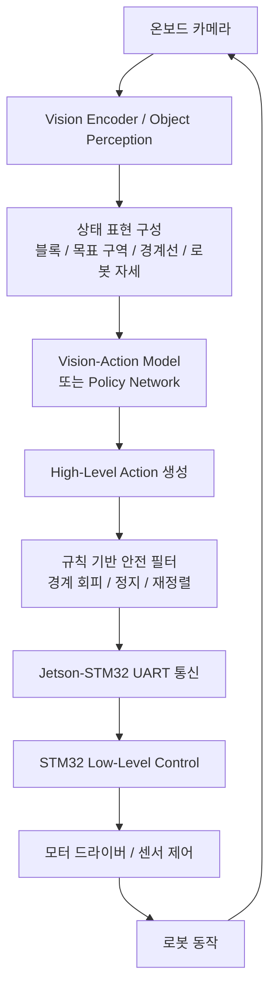
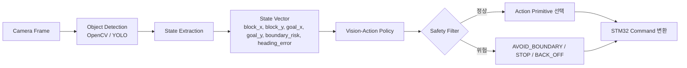
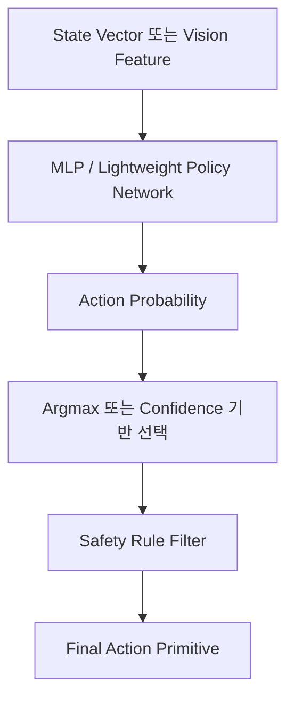

# JetBot Vision-Action Model 기반 자율 물체 수집 RC카 시스템 착수보고서

| 항목 | 내용 |
| --- | --- |
| 과제명 | Push & Clean — 자율 물체 수집 및 목표 지점 이동 |
| 과제 분야 | 피지컬 AI with JetBot |
| 종목 | 종목 1. JetBot을 활용한 지능형 RC카 제어 |
| 소속 | 부산대학교 정보컴퓨터공학부 |
| 팀명 | [작성 필요] |
| 팀원 | [작성 필요] |
| 지도교수 | [작성 필요] |
| 작성일 | [작성 필요] |

---

## 1. 과제 개요

### 1.1 과제 배경 및 필요성

본 과제는 부산대학교 정보컴퓨터공학부 2026학년도 전기 졸업과제의 피지컬 AI with JetBot 분야 중 `Push & Clean — 자율 물체 수집 및 목표 지점 이동` 문제를 대상으로 한다. 해당 문제는 단일 JetBot이 온보드 카메라를 이용하여 경기장 내부에 무작위로 배치된 5개의 경량 스펀지 블록을 인식하고, 이를 정해진 목표 구역으로 이동시키는 자율 RC카 시스템을 설계·구현하는 것을 요구한다.

경기 환경은 1.5~2m 크기의 정사각형 경기장으로 구성되며, 벽은 없고 검은색 테이프 경계선만 존재한다. 경기장 내부에는 5cm × 5cm × 5cm 크기의 스펀지 블록 5개가 놓이고, 목표 구역은 30cm × 30cm 크기의 붉은색 테이프로 표시된다. 평가는 5분 제한 시간 내 목표 구역으로 이동시킨 물체 수를 기준으로 이루어지며, 5개 전체 이동 완료 시 소요 시간에 따른 보너스 점수가 부여된다. 반대로 물체를 경기장 밖으로 밀어낼 경우 감점이 발생한다.

이 문제는 단순히 RC카를 전진, 후진, 회전시키는 제어 문제로 보기 어렵다. 블록의 초기 위치가 매 경기마다 달라지고, 목표 구역과 블록의 상대 위치에 따라 접근 방향과 push 방향이 달라지며, 벽이 없는 경기장에서는 경계선 근처에서 잘못된 방향으로 블록을 밀 경우 즉시 감점 상황이 발생할 수 있다. 또한 로봇은 온보드 카메라만으로 블록, 목표 구역, 경계선을 인식해야 하므로 조명 변화, 카메라 시야 제한, 물체 가림, 인식 오차와 같은 불확실성을 함께 고려해야 한다.

기존의 로봇공학 시스템은 사전에 정의된 환경 모델, 비교적 명확한 센서 입력, 정해진 경로 계획과 제어 규칙을 바탕으로 안정적인 동작을 수행하는 데 강점을 가진다. 이러한 접근은 모터 제어, 주행 안정화, 센서 처리와 같은 저수준 제어를 구현하는 데 필수적이다. 그러나 본 과제처럼 물체 위치가 무작위이고, 로봇이 실시간 카메라 입력을 통해 현재 상황을 해석해야 하며, push 동작의 성공 여부가 물리적 접촉과 자세 정렬에 따라 달라지는 환경에서는 고정된 규칙만으로 모든 상황을 안정적으로 처리하기 어렵다.

따라서 본 과제에서는 기존 로봇공학의 제어 기술을 기반으로 하되, 실제 물리 환경에서 인지(Perception), 판단(Decision), 제어(Control)를 하나의 폐루프로 연결하는 Physical AI 접근을 적용하고자 한다. Physical AI는 로봇이 카메라와 센서로 현재 환경을 관찰하고, AI 기반 판단 또는 정책 모델을 통해 적절한 행동을 선택한 뒤, 이를 실제 제어 명령으로 변환하여 물리 환경에 작용하는 구조를 의미한다. 본 과제에서는 카메라 영상에서 블록과 목표 구역, 경계선을 인식하고, Vision-Action Model을 통해 현재 상태에 적합한 고수준 행동 primitive를 선택하며, STM32 기반 저수준 제어를 통해 실제 모터 동작으로 실행하는 계층형 시스템을 설계한다.

다만 본 과제는 AI가 모든 판단과 제어를 end-to-end로 해결하는 구조를 목표로 하지 않는다. 실제 졸업과제의 구현 가능성과 경기 안정성을 고려하여, 객체 인식 및 상태 추출, Vision-Action Model 또는 Policy Network 기반 행동 선택, 규칙 기반 안전 제어, STM32 저수준 모터 제어를 결합한 hybrid Physical AI 구조를 우선 설계한다. 이를 통해 학습 기반 의사결정의 유연성과 기존 제어 시스템의 안정성을 함께 활용하는 자율 물체 수집 RC카 시스템을 구현하고자 한다.

### 1.2 과제 목표

본 과제의 최종 목표는 단일 JetBot이 온보드 카메라를 이용하여 경기장 내 무작위로 배치된 스펀지 블록 5개를 인식하고, 제한 시간 5분 내 최대한 많은 블록을 붉은색 목표 구역으로 push 방식으로 이동시키는 자율 RC카 시스템을 구현하는 것이다. 이를 위해 단순 주행 제어가 아니라 카메라 기반 환경 인식, Vision-Action 기반 행동 선택, STM32 기반 저수준 제어가 연결된 Physical AI 시스템을 설계한다.

세부 목표는 다음과 같다.

| 목표 구분 | 내용 | 검증 방향 |
| --- | --- | --- |
| 경기 목표 | 5분 제한 시간 내 가능한 많은 스펀지 블록을 목표 구역으로 이동시킨다. | 목표 구역으로 이동 완료한 블록 수 측정 |
| 인식 목표 | 온보드 카메라 기반으로 블록, 붉은색 목표 구역, 검은색 경계선을 인식한다. | 경기장 영상에서 객체 검출 성공률 및 오검출 사례 분석 |
| 상태 표현 목표 | 인식 결과를 바탕으로 블록 위치, 목표 위치, 경계 위험도, 정렬 상태를 포함한 상태 정보를 구성한다. | 주행 로그를 통해 상태 값과 실제 상황의 일치 여부 확인 |
| 행동 결정 목표 | Vision-Action Model 또는 Policy Network를 통해 현재 상태에 적합한 고수준 행동 primitive를 선택한다. | `SEARCH`, `APPROACH_BLOCK`, `ALIGN_PUSH`, `PUSH_FORWARD`, `BACK_OFF`, `AVOID_BOUNDARY`, `STOP` 선택 결과 분석 |
| 제어 목표 | Jetson에서 생성한 고수준 명령을 STM32로 전달하고, STM32가 이를 PWM 및 모터 드라이버 제어로 변환한다. | UART 명령 응답, 모터 동작 정확도, timeout 정지 동작 확인 |
| 안전 목표 | 블록을 경기장 밖으로 밀어내는 상황과 로봇의 경계 이탈 상황을 줄인다. | 경계선 근처 push 실패 사례와 감점 위험 상황 분석 |
| 개선 목표 | 반복 실험을 통해 블록 이동 성공률을 높이고, 5개 전체 이동 시 소요 시간을 줄이는 방향으로 시스템을 개선한다. | 실험 회차별 성공 블록 수와 수행 시간 비교 |

### 1.3 기대 효과

본 과제를 통해 카메라 기반 인식, AI 기반 행동 결정, 임베디드 모터 제어가 결합된 Physical AI 시스템의 전체 흐름을 설계하고 검증할 수 있다. 특히 Jetson 계열 보드가 고수준 인지 및 판단을 담당하고 STM32 MCU가 저수준 모터 제어와 안전 정지를 담당하는 계층형 구조를 적용함으로써, 실제 로봇 시스템에서 사용되는 역할 분리 방식을 졸업과제 수준에서 구현해 볼 수 있다.

또한 Vision-Action Model을 고수준 행동 primitive 선택 문제로 정의함으로써, 완전 end-to-end 제어보다 디버깅과 개선이 쉬운 구조를 구성할 수 있다. 이는 카메라 영상에서 추출한 상태 정보가 실제 로봇 행동으로 어떻게 연결되는지 확인하는 데 도움이 되며, 향후 imitation learning, policy network, 강화학습 기반 로봇 제어로 확장할 수 있는 기반이 될 것으로 기대된다.

마지막으로 본 과제는 실제 경기 환경에서 발생하는 조명 변화, 카메라 시야 제한, 블록 인식 오류, push 정렬 실패, 추론 지연, Jetson-STM32 통신 오류, 경기장 경계 이탈 위험을 직접 다룬다. 따라서 단순 시뮬레이션이나 소프트웨어 구현을 넘어, 물리 환경에서 AI 판단과 제어가 결합될 때 발생하는 현실적 제약을 분석하고 개선하는 공학적 경험을 제공할 것으로 기대된다.

---

## 2. 요구사항 분석

### 2.1 경기 규칙 및 평가 조건 분석

| 구분 | 내용 | 시스템 설계에 미치는 영향 |
| --- | --- | --- |
| 경기장 | 1.5~2m 정사각형 경기장 | 짧은 거리에서 빠르게 블록을 탐색하고 회피해야 함 |
| 경계 | 검은색 테이프 경계선, 벽 없음 | 경계선 검출 및 AVOID_BOUNDARY 동작이 필수적임 |
| 물체 | 5cm × 5cm × 5cm 경량 스펀지 블록 5개 | 작은 물체 인식 정확도와 접근 정렬이 중요함 |
| 목표 구역 | 30cm × 30cm 붉은색 테이프 표시 영역 | 목표 방향 추정과 push 완료 여부 판단에 사용됨 |
| 이동 방식 | 로봇이 블록을 push 방식으로 이동 | 집게나 적재 장치보다 접근 방향과 자세 정렬이 중요함 |
| 제한 시간 | 5분 | 탐색, 접근, 정렬, push 동작의 시간 효율이 필요함 |
| 기본 평가 | 목표 구역으로 이동시킨 물체 수 | 완전 성공보다 안정적으로 여러 블록을 처리하는 전략이 필요함 |
| 보너스 | 5개 전체 이동 완료 시 소요 시간 | 전체 성공 후 시간 최적화가 추가 목표가 됨 |
| 감점 | 물체를 경기장 밖으로 밀어낼 경우 | 경계 근처 블록 처리와 push 방향 제한이 필요함 |

본 과제의 핵심은 제한 시간 내에 가능한 많은 블록을 목표 구역으로 이동시키는 것이다. 따라서 시스템은 전체 맵을 완벽하게 복원하기보다는, 카메라로 관측 가능한 범위에서 블록과 목표 구역을 지속적으로 탐색하고, 현재 성공 가능성이 높은 블록을 선택하여 처리하는 방식으로 설계한다.

### 2.2 기능적 요구사항

| ID | 기능적 요구사항 | 설명 | 우선순위 |
| --- | --- | --- | --- |
| FR-01 | 카메라 영상 수집 | JetBot 또는 Jetson 계열 보드의 온보드 카메라로 실시간 영상을 수집한다. | 높음 |
| FR-02 | 블록 인식 | 영상에서 5cm 스펀지 블록 후보를 검출하고 위치를 추정한다. | 높음 |
| FR-03 | 목표 구역 인식 | 붉은색 테이프 영역을 검출하여 목표 구역의 방향과 상대 위치를 추정한다. | 높음 |
| FR-04 | 경계선 인식 | 검은색 테이프 경계선을 인식하여 경기장 이탈 위험을 판단한다. | 높음 |
| FR-05 | 상태 표현 구성 | 블록, 목표 구역, 경계선, 로봇 자세 추정 정보를 상태 벡터 또는 상태 맵 형태로 구성한다. | 높음 |
| FR-06 | 행동 primitive 선택 | Vision-Action Model 또는 Policy Network가 현재 상태에 맞는 고수준 행동을 선택한다. | 높음 |
| FR-07 | 블록 접근 | 선택된 블록 방향으로 접근하고, push 가능한 위치까지 이동한다. | 높음 |
| FR-08 | push 정렬 | 블록과 목표 구역 방향을 기준으로 로봇 자세를 정렬한다. | 높음 |
| FR-09 | 블록 밀기 | 정렬 후 블록을 목표 구역 방향으로 전진하여 이동시킨다. | 높음 |
| FR-10 | 후진 및 재정렬 | push 실패 또는 정렬 불량 시 후진 후 재탐색 또는 재정렬을 수행한다. | 중간 |
| FR-11 | 경계 회피 | 경계선 접근 시 후진, 회전, 정지 등 안전 동작을 수행한다. | 높음 |
| FR-12 | Jetson-STM32 통신 | Jetson에서 생성한 고수준 명령을 STM32로 전송하고 상태 응답을 수신한다. | 높음 |
| FR-13 | 저수준 모터 제어 | STM32가 PWM, 모터 드라이버, 센서 입력을 이용해 실제 동작을 수행한다. | 높음 |
| FR-14 | 상태 로깅 | 주요 인식 결과, 선택된 action, 통신 상태, 성공/실패 상황을 기록한다. | 중간 |

### 2.3 비기능적 요구사항

| ID | 비기능적 요구사항 | 설명 | 목표 수준 |
| --- | --- | --- | --- |
| NFR-01 | 실시간성 | 카메라 인식, 행동 결정, 모터 명령 전달이 경기 운영에 충분한 속도로 수행되어야 한다. | 5~15 FPS 수준의 의사결정 루프 목표 |
| NFR-02 | 안정성 | 인식 실패, 통신 오류, 경계선 접근 상황에서도 안전 정지 또는 회피가 가능해야 한다. | 오류 발생 시 STOP 또는 BACK_OFF 수행 |
| NFR-03 | 구현 가능성 | 제한된 기간과 하드웨어 성능 내에서 구현 가능한 hybrid 구조를 사용해야 한다. | OpenCV/YOLO + 정책/규칙 결합 |
| NFR-04 | 확장성 | 초기 규칙 기반 정책에서 학습 기반 정책으로 확장할 수 있어야 한다. | 상태 표현과 action primitive를 모듈화 |
| NFR-05 | 유지보수성 | 인식, 판단, 제어 모듈을 분리하여 디버깅과 개선이 가능해야 한다. | Perception/Decision/Control 분리 |
| NFR-06 | 재현성 | 실험 조건, 파라미터, 모델 버전, 경기 결과를 기록할 수 있어야 한다. | 로그 및 실험 기록 관리 |
| NFR-07 | 통신 신뢰성 | Jetson과 STM32 간 명령 손실이나 잘못된 명령 실행을 줄여야 한다. | ACK, checksum, timeout 설계 |
| NFR-08 | 안전성 | 경기장 밖으로 블록을 밀어내거나 로봇이 이탈하는 상황을 최소화해야 한다. | 경계 위험도 기반 action 제한 |

---

## 3. 시스템 설계

### 3.1 전체 시스템 구조

본 시스템은 온보드 카메라 기반 인식 모듈, Vision-Action 기반 행동 결정 모듈, Jetson-STM32 통신 모듈, STM32 저수준 제어 모듈로 구성한다. Jetson 또는 JetBot 계열 보드는 카메라 영상 처리와 AI 추론을 담당하고, STM32는 모터 제어, 센서 입력 처리, 안전 정지 등 시간 민감도가 높은 저수준 제어를 담당한다.



전체 제어 루프는 다음 흐름으로 동작하도록 설계한다.

1. 카메라가 경기장 영상을 입력받는다.
2. Jetson에서 OpenCV 또는 YOLO 기반 인식 모듈이 블록, 목표 구역, 경계선을 추출한다.
3. 추출된 정보를 상태 벡터 또는 간단한 top-view 상태 표현으로 변환한다.
4. Vision-Action Model 또는 Policy Network가 현재 상태에서 수행할 행동 primitive를 선택한다.
5. 선택된 action은 규칙 기반 안전 필터를 통과하며, 경계 위험이나 통신 오류가 있을 경우 안전 동작으로 대체된다.
6. Jetson은 UART 기반 프로토콜로 STM32에 고수준 명령을 전송한다.
7. STM32는 명령을 PWM, 모터 방향, 속도, 정지 조건으로 변환하여 실제 로봇을 제어한다.

### 3.2 Vision-Action Model 기반 행동 결정 구조

Vision-Action Model은 카메라 입력 또는 카메라에서 추출한 상태 정보를 기반으로 로봇이 수행해야 할 고수준 행동 primitive를 선택하는 모듈이다. 본 과제에서는 실제 구현 가능성을 고려하여 다음과 같은 hybrid 구조를 우선 설계한다.



카메라 영상은 먼저 객체 인식 모듈을 통해 블록, 목표 구역, 경계선 후보로 변환된다. 이후 로봇 기준 좌표계에서 선택된 블록의 상대 방향, 목표 구역의 상대 방향, 블록과 목표 구역 사이의 각도, 경계선까지의 위험도 등을 계산한다. 이 상태 정보는 Vision-Action Policy의 입력으로 사용된다.

정책 모델은 현재 상태에서 다음 행동 중 하나를 선택하도록 설계한다.

| Action primitive | 의미 | 사용 상황 |
| --- | --- | --- |
| SEARCH | 회전하며 블록 및 목표 구역 탐색 | 블록 또는 목표 구역이 보이지 않을 때 |
| APPROACH_BLOCK | 선택된 블록 방향으로 접근 | 블록은 보이지만 push 위치에 도달하지 않았을 때 |
| ALIGN_PUSH | 블록과 목표 구역 방향에 맞게 자세 정렬 | 블록을 밀기 전 진행 방향을 맞춰야 할 때 |
| PUSH_FORWARD | 블록을 목표 방향으로 밀기 | 정렬이 충분하고 경계 위험이 낮을 때 |
| BACK_OFF | 후진 | push 실패, 정렬 실패, 너무 가까운 상황에서 재시도할 때 |
| AVOID_BOUNDARY | 경계선 회피 | 검은색 경계선이 가까워졌거나 블록이 밖으로 밀릴 위험이 있을 때 |
| STOP | 정지 | 통신 오류, 인식 불능, 경기 종료, 비상 상황 |

초기 구현에서는 규칙 기반 정책 또는 상태 기계로 action primitive를 선택하고, 이후 수집한 주행 로그를 활용하여 imitation learning 또는 간단한 policy network로 확장하는 방안을 검토한다. 예를 들어 사람이 원격 조종한 성공 사례에서 상태와 행동 쌍을 수집하고, 이를 지도학습 데이터로 사용하여 현재 상태에서 적절한 action primitive를 예측하는 모델을 학습할 수 있다.

### 3.3 Jetson-STM32 계층형 제어 구조

본 시스템은 Jetson과 STM32의 역할을 명확히 분리한 계층형 제어 구조를 사용한다. Jetson은 상대적으로 연산량이 큰 영상 처리와 AI 추론을 수행하고, STM32는 짧은 주기로 안정적인 모터 제어와 센서 처리를 담당한다.

| 계층 | 담당 장치 | 주요 역할 | 예시 |
| --- | --- | --- | --- |
| Perception Layer | Jetson / JetBot | 카메라 영상 수집, 객체 인식, 경계선 검출 | OpenCV 색상 분할, YOLO 기반 블록 검출 |
| Decision Layer | Jetson / JetBot | 상태 표현 구성, Vision-Action Policy 실행, action primitive 선택 | SEARCH, APPROACH_BLOCK, ALIGN_PUSH |
| Safety Layer | Jetson + STM32 | 경계 위험 판단, 명령 timeout 처리, 비상 정지 | AVOID_BOUNDARY, STOP |
| Communication Layer | Jetson + STM32 | UART 기반 명령 송수신, ACK, 상태 응답 | `MOVE`, `TURN`, `PUSH`, `STATUS` |
| Low-Level Control Layer | STM32 | PWM 생성, 모터 방향 제어, 센서 입력 처리 | 좌우 모터 속도 제어, 엔코더/거리 센서 처리 |
| Actuation Layer | 모터/센서 | 실제 로봇 이동 및 push 동작 수행 | 전진, 후진, 회전, 정지 |

이 구조에서는 Jetson이 "무엇을 할지"를 결정하고, STM32가 "어떻게 안정적으로 실행할지"를 담당한다. 예를 들어 Jetson이 `PUSH_FORWARD` action을 선택하면, 이를 UART 명령 `PUSH speed duration` 형태로 STM32에 전달한다. STM32는 해당 명령을 모터 드라이버 제어 신호로 변환하고, 실행 중 센서 값이나 timeout 조건에 따라 정지할 수 있도록 설계한다.

### 3.4 Jetson-MCU 통신 프로토콜 설계

Jetson과 STM32 간 통신은 구현 난이도와 디버깅 편의성을 고려하여 UART를 우선 제안한다. UART는 Jetson과 STM32 사이에서 비교적 단순하게 연결할 수 있고, 텍스트 기반 프로토콜로 초기 디버깅이 가능하다는 장점이 있다. 추후 필요 시 I2C 또는 SPI 방식으로 변경할 수 있으나, 착수 단계에서는 UART 기반 명령/응답 구조를 중심으로 설계한다.

기본 메시지 형식은 다음과 같이 설계한다.

```text
<CMD>,<ARG1>,<ARG2>,<ARG3>,<SEQ>,<CHECKSUM>\n
```

응답 메시지는 다음과 같이 설계한다.

```text
ACK,<SEQ>,<STATUS>,<CHECKSUM>\n
ERR,<SEQ>,<ERROR_CODE>,<CHECKSUM>\n
```

Jetson이 STM32로 보내는 명령 예시는 다음과 같다.

| 명령 | 인자 예시 | 의미 | STM32 처리 |
| --- | --- | --- | --- |
| MOVE | `MOVE,120,500,0` | 지정 속도로 전진 | 좌우 모터를 동일 PWM으로 구동 |
| TURN | `TURN,80,300,L` | 지정 방향으로 회전 | 좌우 모터를 반대 방향 또는 차동 속도로 제어 |
| PUSH | `PUSH,140,1000,0` | 블록을 밀기 위한 전진 | 일정 시간 전진 후 정지, 필요 시 전류/센서 조건 확인 |
| BACK | `BACK,100,400,0` | 후진 | 좌우 모터를 후진 방향으로 구동 |
| STOP | `STOP,0,0,0` | 즉시 정지 | PWM 0, 모터 브레이크 또는 coast 처리 |
| STATUS | `STATUS,0,0,0` | 현재 MCU 상태 요청 | 배터리, 센서, 마지막 명령 상태 응답 |
| SETSPD | `SETSPD,120,110,0` | 좌우 모터 보정 속도 설정 | 좌우 PWM 보정값 적용 |
| PING | `PING,0,0,0` | 통신 상태 확인 | ACK 응답 반환 |

통신 안정성을 위해 다음 항목을 포함할 계획이다.

- 각 명령에 sequence number를 부여하여 중복 실행이나 응답 누락을 확인한다.
- 일정 시간 내 ACK가 없으면 Jetson은 명령을 재전송하거나 STOP 명령을 보낸다.
- STM32는 명령 checksum을 확인하고 잘못된 명령은 실행하지 않는다.
- STM32는 마지막 명령 수신 이후 timeout이 발생하면 자동으로 모터를 정지한다.
- 디버깅 단계에서는 텍스트 기반 명령을 사용하고, 필요 시 바이너리 프로토콜로 최적화한다.

---

## 4. 주요 기술 설계

### 4.1 카메라 기반 환경 인식

카메라 기반 환경 인식은 본 시스템의 입력 단계로, 로봇이 현재 경기장 안에서 어떤 블록을 처리할 수 있는지 판단하는 데 필요한 정보를 제공한다. 초기 구현에서는 OpenCV 기반 색상/형상 인식을 우선 적용하고, 성능이 부족할 경우 YOLO 계열 경량 객체 인식 모델을 추가로 검토한다.

인식 대상은 다음과 같다.

| 인식 대상 | 후보 방법 | 출력 정보 |
| --- | --- | --- |
| 스펀지 블록 | OpenCV 색상 분할, contour 검출, YOLO 객체 검출 | 블록 중심 좌표, bounding box, 신뢰도 |
| 목표 구역 | 붉은색 테이프 색상 분할, contour 검출 | 목표 구역 중심, 면적, 방향 |
| 경기장 경계선 | 검은색 테이프 검출, edge/line 검출 | 경계선 위치, 로봇과의 거리 위험도 |
| 로봇 진행 가능 영역 | 경계선과 장애물 후보를 이용한 마스크 구성 | 안전 이동 가능 방향 |

OpenCV 기반 방식은 구현이 빠르고 디버깅이 쉬우며, 경기장과 물체의 색상이 명확할 경우 충분한 성능을 기대할 수 있다. 다만 조명 변화나 배경 색상 간섭에 취약할 수 있으므로 HSV 색공간 기반 threshold, morphology 연산, contour 면적 필터링, frame 간 smoothing을 적용할 계획이다.

YOLO 기반 방식은 블록 인식이 색상만으로 불안정할 경우 대안으로 사용한다. Jetson의 연산 성능을 고려하여 YOLOv5n, YOLOv8n, 또는 TensorRT 변환이 가능한 경량 모델을 후보로 검토한다. 단, 착수 단계에서는 학습 데이터 수집과 라벨링 비용을 고려하여 OpenCV 기반 baseline을 먼저 구현하고, 성능 한계가 명확해질 경우 YOLO 기반 인식으로 확장하는 방식을 계획한다.

### 4.2 상태 표현 및 행동 primitive 정의

Vision-Action Policy가 안정적으로 동작하려면 카메라 인식 결과를 모델이 사용할 수 있는 상태 표현으로 변환해야 한다. 본 과제에서는 영상 전체를 직접 입력하는 방식과, 객체 인식 결과를 정리한 상태 벡터 입력 방식을 함께 검토하되, 초기 구현은 상태 벡터 기반으로 진행할 계획이다.

상태 벡터 예시는 다음과 같다.

| 상태 변수 | 의미 | 예시 범위 |
| --- | --- | --- |
| `block_visible` | 선택 가능한 블록이 보이는지 여부 | 0 또는 1 |
| `block_x` | 카메라 화면 기준 블록 중심 x 좌표 | -1.0~1.0 |
| `block_y` | 카메라 화면 기준 블록 중심 y 좌표 | 0.0~1.0 |
| `block_conf` | 블록 인식 신뢰도 | 0.0~1.0 |
| `goal_visible` | 목표 구역이 보이는지 여부 | 0 또는 1 |
| `goal_x` | 목표 구역 중심 x 좌표 | -1.0~1.0 |
| `goal_y` | 목표 구역 중심 y 좌표 | 0.0~1.0 |
| `heading_error` | 블록-목표 방향과 로봇 진행 방향의 차이 | -180~180도 |
| `boundary_risk` | 경계선 접근 위험도 | 0.0~1.0 |
| `push_alignment` | push 정렬이 충분한지 나타내는 값 | 0.0~1.0 |
| `last_action` | 직전 action primitive | categorical |
| `elapsed_time` | 경기 시작 후 경과 시간 | 0~300초 |

행동 primitive는 시스템이 직접 제어 가능한 고수준 행동 집합으로 정의한다. 이 방식은 모델 출력 공간을 단순화하고, STM32 저수준 제어와 연결하기 쉽다는 장점이 있다.

| Primitive | 설명 | 종료 조건 |
| --- | --- | --- |
| SEARCH | 제자리 회전 또는 짧은 탐색 주행으로 블록과 목표 구역을 찾는다. | 블록 또는 목표 구역 검출 |
| APPROACH_BLOCK | 선택된 블록이 화면 중심에 오도록 접근한다. | 블록과의 거리 임계값 도달 |
| ALIGN_PUSH | 블록 뒤쪽에서 목표 구역 방향으로 밀 수 있도록 자세를 조정한다. | `heading_error`와 `push_alignment`가 기준 만족 |
| PUSH_FORWARD | 일정 속도로 전진하여 블록을 목표 방향으로 민다. | 목표 구역 도달 추정, timeout, 경계 위험 |
| BACK_OFF | 후진하여 재정렬할 공간을 확보한다. | 지정 거리 또는 시간 완료 |
| AVOID_BOUNDARY | 경계선에서 멀어지도록 후진 및 회전한다. | `boundary_risk` 감소 |
| STOP | 모든 모터 출력을 정지한다. | 운영자 재개 또는 다음 명령 수신 |

### 4.3 Vision-Action Policy 설계

Vision-Action Policy는 현재 상태에서 어떤 행동 primitive를 선택할지 결정하는 핵심 모듈이다. 본 과제에서는 단계적으로 구현 난이도를 높이는 방식을 계획한다.

1단계에서는 규칙 기반 상태 기계를 구현한다. 예를 들어 블록이 보이지 않으면 `SEARCH`, 블록이 보이지만 멀리 있으면 `APPROACH_BLOCK`, 블록이 가까우나 목표 방향과 정렬되지 않았으면 `ALIGN_PUSH`, 정렬이 충분하면 `PUSH_FORWARD`를 선택한다. 경계선 위험도가 높으면 어떤 상태에서도 `AVOID_BOUNDARY` 또는 `STOP`을 우선 적용한다.

2단계에서는 규칙 기반 정책으로 주행 데이터를 수집하고, 사람이 원격으로 보정한 성공 사례를 함께 기록한다. 이 데이터는 상태 벡터와 선택된 action primitive의 쌍으로 저장하여 imitation learning 학습 데이터로 사용할 수 있다.

3단계에서는 간단한 policy network를 구성한다. 입력은 상태 벡터 또는 Vision Encoder 출력이며, 출력은 action primitive에 대한 확률 분포로 설계한다. 모델은 cross entropy loss를 이용한 지도학습 방식으로 학습할 수 있으며, 실제 경기장에서는 가장 높은 확률의 action을 선택하되 안전 필터를 통과한 뒤 실행한다.

정책 구조 예시는 다음과 같다.



완전 end-to-end 제어는 카메라 영상에서 직접 모터 PWM을 출력하는 방식으로 확장 가능하지만, 본 과제에서는 디버깅 가능성과 경기 안정성을 위해 우선 고수준 action primitive를 출력하는 구조를 사용한다. 이를 통해 모델이 잘못된 판단을 하더라도 안전 필터와 STM32 timeout 제어로 위험을 줄일 수 있다.

### 4.4 STM32 기반 모터 및 센서 제어

STM32는 Jetson에서 전달받은 고수준 명령을 실제 모터 제어 신호로 변환한다. Jetson의 AI 추론 루프는 영상 처리 지연에 영향을 받을 수 있으므로, 모터 제어와 안전 정지는 STM32에서 독립적으로 수행할 수 있도록 설계한다.

STM32의 주요 기능은 다음과 같다.

- UART 명령 수신 및 파싱
- 명령 checksum 및 sequence number 확인
- 좌우 DC 모터 PWM 출력
- 전진, 후진, 좌회전, 우회전, 정지 동작 수행
- 모터별 속도 보정값 적용
- 센서 입력 처리
- 명령 timeout 발생 시 자동 정지
- Jetson으로 실행 상태 또는 오류 상태 응답

저수준 제어는 다음과 같은 형태로 설계한다.

| 제어 항목 | 설명 |
| --- | --- |
| PWM 제어 | 좌우 모터 속도를 독립적으로 제어하여 직진성과 회전 성능을 보정한다. |
| 방향 제어 | H-bridge 또는 모터 드라이버 입력을 이용해 전진/후진 방향을 설정한다. |
| 속도 보정 | 좌우 모터 편차로 인한 drift를 줄이기 위해 보정 계수를 적용한다. |
| timeout 제어 | 일정 시간 새 명령이 없으면 모터를 정지한다. |
| 비상 정지 | STOP 명령 또는 오류 상태에서 즉시 PWM을 0으로 설정한다. |
| 상태 응답 | 마지막 명령, 오류 코드, 센서 상태를 Jetson에 반환한다. |

추가 센서가 사용 가능한 경우, 거리 센서나 엔코더를 활용하여 push 거리, 경계 접근 여부, 모터 동작 상태를 보조적으로 판단할 수 있다. 다만 센서 구성이 확정되지 않은 착수 단계에서는 카메라 기반 인식을 주 입력으로 두고, STM32 센서는 안전성과 제어 안정성을 보완하는 역할로 설계한다.

### 4.5 안전 제어 및 예외 처리

본 과제에서는 경기장 밖으로 블록을 밀어내는 경우 감점이 발생하므로, 안전 제어는 단순 부가 기능이 아니라 핵심 기능으로 다룬다. 안전 제어는 Jetson의 판단 단계와 STM32의 실행 단계에 모두 포함한다.

Jetson 측 안전 제어는 다음 상황을 감지한다.

- 블록 뒤쪽으로 접근했지만 목표 방향이 경계선 바깥을 향하는 경우
- 경계선이 카메라 하단 또는 진행 방향 가까이에 검출되는 경우
- 목표 구역이 보이지 않는 상태에서 장시간 push하려는 경우
- 블록 인식 신뢰도가 낮아 잘못된 물체를 밀 가능성이 있는 경우
- 추론 지연 또는 프레임 누락으로 최신 상태를 확인하지 못한 경우

STM32 측 안전 제어는 다음 상황을 처리한다.

- Jetson 명령 수신이 일정 시간 이상 끊어진 경우 자동 정지
- checksum 오류가 있는 명령은 실행하지 않고 ERR 응답
- 실행 시간이 긴 명령은 duration 제한 후 자동 정지
- STOP 명령은 다른 명령보다 우선 처리
- 센서 값이 비정상일 경우 모터 출력을 제한하거나 정지

예외 처리 정책은 다음과 같이 설계한다.

| 예외 상황 | 기본 대응 |
| --- | --- |
| 블록 미검출 | SEARCH 수행 |
| 목표 구역 미검출 | SEARCH 또는 현재 블록 주변에서 재탐색 |
| 경계선 접근 | AVOID_BOUNDARY 우선 수행 |
| push 정렬 실패 | BACK_OFF 후 ALIGN_PUSH 재시도 |
| 통신 ACK 누락 | 명령 재전송 후 실패 시 STOP |
| 추론 지연 | 마지막 action 반복 제한 후 STOP |
| 잘못된 명령 수신 | STM32에서 ERR 응답 후 명령 폐기 |

---

## 5. 현실적 제약 사항 및 대책

| 제약 사항 | 예상 문제 | 대응 방안 |
| --- | --- | --- |
| 카메라 시야 제한 | 블록 또는 목표 구역이 한 번에 보이지 않을 수 있음 | SEARCH primitive를 통해 회전 탐색을 수행하고, 최근 관측 정보를 일정 시간 유지한다. |
| 조명 변화 | 색상 기반 블록/목표/경계 인식이 불안정해질 수 있음 | HSV threshold 보정, white balance 고정, morphology 필터, 조명 조건별 캘리브레이션을 적용한다. |
| 블록 인식 오류 | 배경이나 그림자를 블록으로 오인할 수 있음 | contour 크기/비율 필터링, YOLO 기반 검출 후보, frame 간 추적을 함께 사용한다. |
| 목표 구역 인식 오류 | 붉은색 테이프가 부분적으로 가려지거나 왜곡될 수 있음 | 색상 분할과 면적 기준을 결합하고, 목표 구역 관측 이력을 유지한다. |
| 블록을 비스듬히 밀어 실패하는 문제 | 블록이 목표 방향이 아닌 옆으로 밀리거나 회전할 수 있음 | ALIGN_PUSH 단계에서 heading error와 push alignment 기준을 두고, 실패 시 BACK_OFF 후 재정렬한다. |
| 경기장 밖으로 블록을 밀어내는 문제 | 경계 근처 블록을 잘못 밀면 감점이 발생할 수 있음 | boundary risk가 높은 방향으로 PUSH_FORWARD를 금지하고, 경계 근처에서는 AVOID_BOUNDARY 또는 다른 블록 선택을 수행한다. |
| Jetson 추론 지연 | 영상 처리와 모델 추론으로 제어 반응이 늦어질 수 있음 | 경량 모델 사용, 입력 해상도 조절, 프레임 스킵, TensorRT 최적화, STM32 timeout 정지를 적용한다. |
| STM32와 Jetson 간 통신 오류 | 명령 손실, 중복 실행, 잘못된 명령 실행 가능성이 있음 | sequence number, ACK/ERR 응답, checksum, command timeout, STOP 우선순위를 설계한다. |
| 작은 블록 크기 | 5cm 블록은 거리와 각도에 따라 카메라에서 작게 보일 수 있음 | 카메라 장착 각도 조정, 가까운 거리 탐색 전략, YOLO 학습 데이터 보강을 검토한다. |
| 로봇 직진성 부족 | 좌우 모터 편차로 push 방향이 틀어질 수 있음 | STM32에서 좌우 PWM 보정값을 적용하고, 필요 시 엔코더 또는 영상 기반 피드백으로 보정한다. |
| 목표 구역 내 진입 판정 어려움 | 블록이 목표 구역에 들어갔는지 카메라 한 장면으로 판단하기 어려울 수 있음 | 목표 구역과 블록의 겹침 면적, push 후 후진 관측, 여러 프레임 확인을 통해 성공 여부를 추정한다. |
| 학습 데이터 부족 | Vision-Action Policy 학습에 충분한 데이터가 없을 수 있음 | 초기에는 규칙 기반 정책을 사용하고, 원격 조종 및 실험 로그를 수집하여 imitation learning 데이터로 확장한다. |
| 경기장 바닥 반사 또는 테이프 훼손 | 검은색 경계선과 붉은색 목표 구역 검출이 불안정할 수 있음 | 색상 범위 재보정, line/contour 기반 후처리, 인식 신뢰도 기준을 적용한다. |
| 배터리 전압 변화 | 시간이 지날수록 모터 속도와 직진성이 변할 수 있음 | 배터리 상태를 점검하고, PWM 보정 및 속도 제한값을 실험적으로 조정한다. |

---

## 6. 추진 일정

| 기간 | 주요 목표 | 세부 내용 | 산출물 |
| --- | --- | --- | --- |
| 5월 | 문제 분석 및 시스템 구조 확정 | 경기 규칙 분석, 하드웨어 구성 검토, Jetson-STM32 계층형 구조 설계, 착수보고서 작성 | 착수보고서, 시스템 아키텍처 초안 |
| 6월 | 하드웨어 기본 구동 및 통신 구현 | JetBot/Jetson 카메라 동작 확인, STM32 모터 제어, UART 명령 프로토콜 구현, 기본 MOVE/TURN/STOP 테스트 | 기본 주행 코드, UART 통신 테스트 결과 |
| 7월 | 카메라 기반 인식 baseline 구현 | OpenCV 기반 블록/목표/경계선 인식, HSV threshold 조정, 인식 로그 저장, 경기장 테스트 | 인식 모듈, 테스트 영상/로그 |
| 8월 | 행동 primitive 및 규칙 기반 정책 구현 | SEARCH, APPROACH_BLOCK, ALIGN_PUSH, PUSH_FORWARD, BACK_OFF, AVOID_BOUNDARY 구현, 상태 기계 설계 | action primitive 제어 코드, 초기 통합 시스템 |
| 9월 | Vision-Action Policy 고도화 | 상태 벡터 정리, 주행 데이터 수집, policy network 또는 imitation learning 적용 가능성 검토, 안전 필터 개선 | 정책 모델 후보, 실험 결과, 실패 사례 분석 |
| 10월 | 통합 테스트 및 최종 개선 | 5분 경기 시나리오 반복 실험, 블록 이동 성공률 개선, 보고서/발표 자료 작성, 시연 준비 | 최종 시스템, 결과 보고서, 발표 자료 |

---

## 7. 역할 분담

| 역할 | 담당자 | 주요 업무 |
| --- | --- | --- |
| 팀원 A | [작성 필요] | Jetson/JetBot 환경 구축, 카메라 입력 처리, OpenCV/YOLO 기반 객체 인식 구현 |
| 팀원 B | [작성 필요] | Vision-Action Policy 설계, 상태 벡터 구성, 행동 primitive 및 안전 필터 구현 |
| 팀원 C | [작성 필요] | STM32 펌웨어, 모터 제어, UART 통신 프로토콜, 저수준 안전 정지 구현 |
| 공통 | 전체 팀원 | 경기장 테스트, 실험 로그 분석, 보고서 작성, 발표 및 시연 준비 |

역할은 초기 구현 단계에서 위와 같이 분담하되, 통합 테스트 단계에서는 인식, 판단, 제어 모듈 간 인터페이스 문제를 공동으로 점검할 계획이다. 특히 Vision-Action Policy의 출력이 STM32 명령으로 안정적으로 변환되는지, 실제 push 동작에서 블록이 목표 방향으로 이동하는지 반복 실험을 통해 검증한다.

---

## 8. 참고 문헌

아래 항목은 추후 실제 구현 과정에서 참고한 자료명, 문서 버전, 접근 일자 등을 보완할 예정이다. 착수보고서 단계에서는 실제 URL을 임의로 작성하지 않고, 참고할 문헌 및 문서 종류를 placeholder로 정리한다.

| 구분 | 참고 예정 자료 |
| --- | --- |
| JetBot 플랫폼 | NVIDIA JetBot 공식 문서 및 예제 코드 |
| Jetson 개발 환경 | NVIDIA Jetson Linux, JetPack, CUDA, TensorRT 관련 문서 |
| 객체 인식 | OpenCV 공식 문서, YOLO 계열 모델 문서, 경량 객체 검출 모델 관련 자료 |
| 임베디드 제어 | STM32 HAL/LL 드라이버 문서, PWM 및 UART 예제 자료 |
| 로봇 제어 구조 | 계층형 로봇 제어 구조, behavior-based robotics, finite state machine 관련 교재/논문 |
| Vision-Action Model | visual policy learning, imitation learning, vision-based robot control 관련 논문 |
| 경기 운영 자료 | 부산대학교 정보컴퓨터공학부 졸업과제 공지문 및 Push & Clean 종목 설명 자료 |

---

## 9. 추후 보완할 항목

착수보고서 초안 작성 이후 다음 항목은 팀 내부 논의 및 실제 구현 진행 상황에 따라 보완할 계획이다.

- 팀명
- 팀원 이름 및 학번
- 지도교수명
- 최종 사용 장비명
- JetBot 또는 Jetson 보드 세부 모델
- STM32 보드 및 모터 드라이버 세부 모델
- 카메라 모델 및 장착 위치
- 블록 색상 및 실제 경기장 조명 조건
- Vision-Action Model의 최종 구조
- OpenCV 기반 인식과 YOLO 기반 인식 중 최종 선택 기준
- 상태 벡터 세부 정의 및 정규화 방식
- action primitive별 파라미터
- Jetson-STM32 UART 프로토콜의 최종 메시지 형식
- 안전 제어 기준값
- 실험 결과 및 정량 평가
- 실패 사례 분석 및 개선 결과
- 최종 발표 자료와 시연 영상 구성
